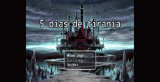
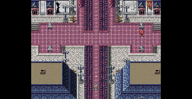
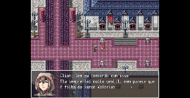
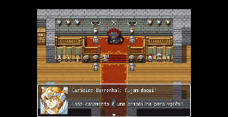
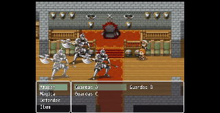
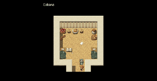
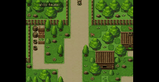

# Game-5-dias-de-tirania

**Contexto Acadêmico:**
Projeto desenvolvido para a disciplina IMD0521 - Fundamentos de Jogos Digitais (2025.1) na Universidade Federal do Rio Grande do Norte (UFRN), sob orientação do Professor Dr. Charles Andrye Galvão Madeira.

## 📖 Sinopse e Enredo
Na pele de Elian, um humilde camponês de uma longínqua aldeia, você é convocado a representar seu povo no casamento de Eurídice, filha do cruel suserano Valerius Harrenhal. A atmosfera festiva é quebrada quando o tirano acusa os líderes dos feudos de roubarem uma relíquia ancestral de valor inestimável. 

Em retaliação, Valerius inicia uma inquisição brutal, ordenando que seus soldados dizimem a população até que o objeto seja recuperado. Trocando a enxada por uma arma, Elian é catapultado para o papel de investigador e guerreiro. O tempo é implacável: o grupo tem exatamente **5 dias (120 horas)** para resolver o mistério antes que o massacre geral seja ordenado.

## ✨ Características Principais
* **Gênero:** RPG de Investigação e Sobrevivência.
* **Público Alvo:** Juvenil/Adulto.
* **Duração Estimada:** 1 a 2 horas.
* **Engine:** RPG Maker MV, utilizando extensões VisuStella e Yanfly para batalhas em turno e menus customizados.

## ⚙️ Mecânicas de Jogo
O gameplay é dividido em duas frentes vitais de sobrevivência e dedução:

**1. Investigação**
* **Coleta de Pistas:** Interação com objetos do cenário (escrivaninhas, livros, corpos) para revelar textos ou desbloquear diálogos.
* **Árvores de Diálogo:** Sistema ramificado onde NPCs podem mentir, revelar segredos ou reagir à sua reputação.
* **Sistema de Dedução:** Combinação de itens no inventário para gerar novas provas e desmascarar mentiras.
* **Quebra-Cabeças Ambientais:** Sistemas de chaves, decodificação de símbolos e observação minuciosa do cenário.

**2. Sobrevivência e Pressão**
* **O Relógio da Sentença:** Sistema de tempo real/ciclos. Algumas pistas e eventos só surgem em horários específicos (Dia/Noite), e recursos possuem prazo de validade.
* **Sanidade e Estresse:** O jogador lida com a degradação mental ao presenciar horrores, podendo sofrer alucinações ou Game Over.
* **Furtividade (Stealth):** Segmentos onde evitar inimigos é obrigatório sob pena de punições severas.
* **Gerenciamento de Recursos:** Inventário limitado e controle rigoroso de consumíveis (comida, água, remédios).

## 🗺️ Estrutura de Níveis (Os 5 Atos)
O jogo acompanha a contagem regressiva para a aniquilação:
* **Dia 1 (Horas 1-24) - A Fuga e o Caos:** Sobreviva ao pânico na Bastilha da Agonia, escape e recrute seu primeiro aliado.
* **Dia 2 (Horas 25-48) - As Primeiras Pistas:** Navegue sob lei marcial para interrogar testemunhas.
* **Dia 3 (Horas 49-72) - A Conspiração se Aprofunda:** A revelação de que o roubo é parte de algo muito maior.
* **Dia 4 (Horas 73-96) - Reunindo os Aliados:** Decisões críticas: expor a verdade ou forjar alianças perigosas?.
* **Dia 5 (Horas 97-120) - O Dia do Juízo Final:** O prazo se esgota, levando a finais múltiplos (Vitória Pírrica, Revolucionário, Trágico ou O Novo Tirano).

## 👥 Personagens
* **Elian (Protagonista):** Camponês transformado em guerreiro para salvar seu povo.
* **Valerius Harrenhal:** O suserano tirano e vilão principal.
* **Eurídice Harrenhal:** A filha do tirano, empática e mantida isolada pelo pai.
* **Nero, o Inquisitor:** Camponês corrompido que se tornou o sádico sub-chefe das forças de repressão.
* **NPCs:** Povo comum (pescadores, artesãos, espiões duplos) e Capangas genéricos corrompidos pela violência.

# 🎬 Apresentação dos slides: 5 Dias de Tirania

**🔗 Acesso ao Material**
* [Assistir à Apresentação no Google Drive](https://drive.google.com/drive/u/0/search?q=5%20dias%20de%20tirania)

---
*Gabriel Giulian fala a partir do tempo 7:10.

# 🎮 Apresentação da Gameplay do jogo: 5 Dias de Tirania

**🔗 Acesso ao Vídeo**
* [Assistir à Apresentação de Gameplay no Google Drive](https://drive.google.com/file/d/1A931n0bjc8k5fsaCikvWoajPUBw6dy2S/view?usp=sharing)

---
*Gabriel Giulian fala do começo ao fim.

## 🎨 Direção de Arte e Interface
* **Filosofia "Gótico Arcano":** O visual mescla a brutalidade medieval com energias arcanas brilhantes, contrastando a opressão de pedra fria com "LEDs mágicos" em tons de Ciano (Mana), Âmbar (Urgência) e Verde-Néon (Corrupção).
* **Estilo Visual:** Pixel Art de 16/32 bits maduro e realista, fortemente inspirado na iluminação de *Octopath Traveler*, na opressão de *Blasphemous* e na paleta de desespero de *Darkest Dungeon*. Inspirações narrativas incluem *Game of Thrones*, *Castlevania*, *Coração Valente* e *Vinland Saga*.
* **O HUD:** Minimalista e translúcido, destacando o "Relógio da Sentença" (pulsando em âmbar) no canto superior direito, retratos de aliados e um menu rápido acessível.

## 💻 Requisitos do Sistema
* **Plataformas:** Windows, Linux
* **Memória:** 2 GB RAM
* **Gráficos:** DirectX 8
* **Processador:** Intel Celeron
* **Armazenamento:** 500 MB de espaço livre

## 🚀 Como Jogar
1. Faça o download dos arquivos do jogo através do nosso repositório no Google Drive: [Download via Google Drive](https://drive.google.com/file/d/18syyy-0nMYQ3i8iKG_3eAgFnzifWcqlE/view?usp=sharing)
2. Extraia o arquivo baixado em uma pasta de sua preferência.
3. Execute o arquivo principal do jogo (`Game - 5 dias de tirania.exe`).

## 📸 Galeria do jogo

<table align="center">
  <tr>
    <td align="center">
       
      <em><b>A Sombra de Valerius</b></em>
    </td>
    <td align="center">
       
      <em><b>Sob os Olhos do Tirano</b></em>
    </td>
  </tr>
  <tr>
    <td align="center">
       
      <em><b>Novos Aliados</b></em>
    </td>
    <td align="center">
       
      <em><b>A Armadilha</b></em>
    </td>
  </tr>
  <tr>
    <td align="center">
       
      <em><b>A Fúria de Elian</b></em>
    </td>
    <td align="center">
       
      <em><b>Buscando Respostas</b></em>
    </td>
  </tr>
  <tr>
    <td align="center" colspan="2">
       
      <em><b>O Mundo Lá Fora</b></em>
    </td>
  </tr>
</table>

## 🛠️ Equipe de Desenvolvimento
* **Gabriel Giulian:** Desenvolvedor e Produtor.
* **Caio Gabriel:** Desenvolvedor.
* **Francisco Warlen:** Game Designer.
